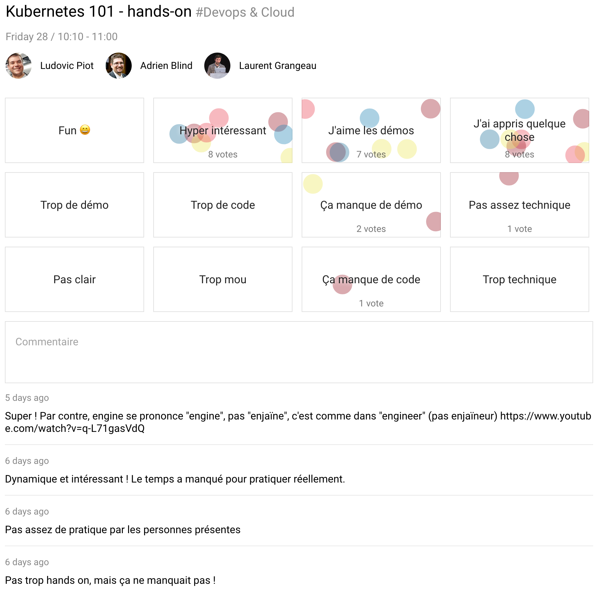

# SunnyTech — june 27-28, 2019

- 🌍Montpellier
- 📆june 28, 2019 - 10h10-12h10
- 📦hands-on workshop
- 👨🏻‍Speakers:
  - [Ludovic Piot](https://sunny-tech.io/speakers/6gcb9OjG5cgl14IQBEt5yu4TmTT2)
  - [Adrien Blind](https://sunny-tech.io/speakers/UReg1U2dk9XFlCrkxjN6JWVCoB92)
  - [Laurent Grangeau](https://sunny-tech.io/speakers/VeBTP8lqOYaXBCpwTlGjBW2n1yH2)

> 📖🇫🇷 [Kubernetes 101 - hands-on](https://sunny-tech.io/schedule/2019-06-28?sessionId=8)  
> A travers un atelier _hands-on_, découvrez
>  
> - les bases de l'orchestration de _containers_ via `Docker` et `docker-compose`,
> - le fonctionnement de `Kubernetes`,
> - et comment déployer ses premières _stacks_ applicatives dessus
> - enfin, comment utiliser `Kubernetes` de manière fluide pendant le processus de développement en mode _CI/CD_.

- 🦊 https://gitlab.com/thegaragebandofit/kubernetes-101-workshop
- 🯠

[[Home]](../README.md)
